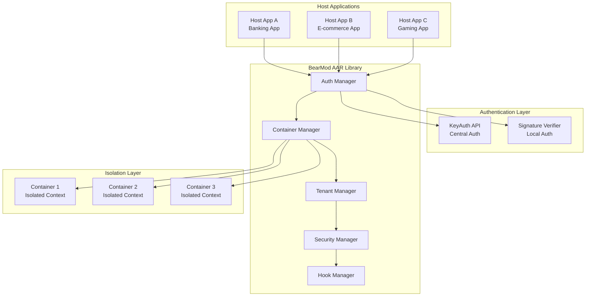

# BearMod AAR Integration Architecture Guide

## 🏗️ Multi-Tenant AAR Architecture Overview



## 1. 🔐 AAR Integration Authentication

### Recommended Multi-Layer Authentication Strategy

#### **Layer 1: Application Signature Verification**
```kotlin
// Enhanced SignatureVerifier for AAR authentication
class BearModAuthenticator {
    
    companion object {
        private const val BEARMOD_AUTH_KEY = "bearmod_auth_signature"
        private val AUTHORIZED_SIGNATURES = setOf(
            "SHA256:1234567890abcdef...", // Host App A signature
            "SHA256:fedcba0987654321...", // Host App B signature
            "SHA256:abcdef1234567890..."  // Host App C signature
        )
    }
    
    fun authenticateHostApplication(context: Context): AuthResult {
        val hostSignature = getHostAppSignature(context)
        val isAuthorized = AUTHORIZED_SIGNATURES.contains(hostSignature)
        
        return AuthResult(
            isAuthenticated = isAuthorized,
            hostSignature = hostSignature,
            hostPackageName = context.packageName,
            authLevel = if (isAuthorized) AuthLevel.TRUSTED else AuthLevel.DENIED
        )
    }
    
    private fun getHostAppSignature(context: Context): String {
        return SignatureVerifier.getAppSignature(context)
    }
}
```

#### **Layer 2: Token-Based Authentication**
```kotlin
// Token-based authentication for runtime validation
class TokenAuthenticator {
    
    fun validateAuthToken(token: String, hostContext: HostContext): TokenValidationResult {
        return try {
            val decodedToken = JWT.decode(token)
            val isValid = validateTokenClaims(decodedToken, hostContext)
            val permissions = extractPermissions(decodedToken)
            
            TokenValidationResult(
                isValid = isValid,
                permissions = permissions,
                expiresAt = decodedToken.expiresAt,
                hostId = decodedToken.getClaim("host_id").asString()
            )
        } catch (e: Exception) {
            TokenValidationResult.invalid("Token validation failed: ${e.message}")
        }
    }
    
    private fun validateTokenClaims(token: DecodedJWT, hostContext: HostContext): Boolean {
        val hostId = token.getClaim("host_id").asString()
        val packageName = token.getClaim("package_name").asString()
        val permissions = token.getClaim("permissions").asList(String::class.java)
        
        return hostId == hostContext.hostId &&
               packageName == hostContext.packageName &&
               !token.isExpired &&
               permissions.isNotEmpty()
    }
}
```

#### **Layer 3: Cryptographic Challenge-Response**
```kotlin
// Advanced cryptographic authentication
class CryptoAuthenticator {
    
    fun performChallengeResponse(hostContext: HostContext): ChallengeResult {
        val challenge = generateChallenge()
        val expectedResponse = computeExpectedResponse(challenge, hostContext)
        
        return ChallengeResult(
            challenge = challenge,
            expectedResponse = expectedResponse,
            expiresAt = System.currentTimeMillis() + CHALLENGE_TIMEOUT
        )
    }
    
    fun validateChallengeResponse(
        challenge: String,
        response: String,
        hostContext: HostContext
    ): Boolean {
        val expectedResponse = computeExpectedResponse(challenge, hostContext)
        return MessageDigest.isEqual(
            response.toByteArray(),
            expectedResponse.toByteArray()
        )
    }
    
    private fun computeExpectedResponse(challenge: String, hostContext: HostContext): String {
        val data = "$challenge:${hostContext.hostId}:${hostContext.packageName}"
        return HMAC.sha256(data, hostContext.secretKey)
    }
}
```

## 2. 🏢 Multi-Container Support Strategy

### Container Isolation Architecture

```kotlin
// Container management for multi-tenant support
class BearModContainerManager {
    
    private val containers = ConcurrentHashMap<String, BearModContainer>()
    private val containerLock = ReentrantReadWriteLock()
    
    fun createContainer(hostContext: HostContext, config: ContainerConfig): BearModContainer {
        containerLock.writeLock().lock()
        try {
            val containerId = generateContainerId(hostContext)
            val container = BearModContainer(
                id = containerId,
                hostContext = hostContext,
                config = config,
                isolationLevel = config.isolationLevel,
                securityPolicy = config.securityPolicy
            )
            
            containers[containerId] = container
            return container
        } finally {
            containerLock.writeLock().unlock()
        }
    }
    
    fun getContainer(containerId: String): BearModContainer? {
        containerLock.readLock().lock()
        try {
            return containers[containerId]
        } finally {
            containerLock.readLock().unlock()
        }
    }
    
    fun destroyContainer(containerId: String) {
        containerLock.writeLock().lock()
        try {
            containers[containerId]?.cleanup()
            containers.remove(containerId)
        } finally {
            containerLock.writeLock().unlock()
        }
    }
}
```

### Isolated Container Implementation

```kotlin
// Individual container with complete isolation
class BearModContainer(
    val id: String,
    val hostContext: HostContext,
    val config: ContainerConfig,
    val isolationLevel: IsolationLevel,
    val securityPolicy: SecurityPolicy
) {
    
    private val hookManager = IsolatedHookManager(this)
    private val securityAnalyzer = IsolatedSecurityAnalyzer(this)
    private val dataStore = IsolatedDataStore(this)
    private val eventBus = IsolatedEventBus(this)
    
    fun initialize(): InitializationResult {
        return try {
            // Initialize isolated components
            hookManager.initialize()
            securityAnalyzer.initialize()
            dataStore.initialize()
            eventBus.initialize()
            
            InitializationResult.success(this)
        } catch (e: Exception) {
            InitializationResult.failure("Container initialization failed", e)
        }
    }
    
    fun getHookManager(): IsolatedHookManager = hookManager
    fun getSecurityAnalyzer(): IsolatedSecurityAnalyzer = securityAnalyzer
    fun getDataStore(): IsolatedDataStore = dataStore
    fun getEventBus(): IsolatedEventBus = eventBus
    
    fun cleanup() {
        hookManager.cleanup()
        securityAnalyzer.cleanup()
        dataStore.cleanup()
        eventBus.cleanup()
    }
}
```

## 3. 🎨 White-Label/Rebrand Support

### Configuration-Based Customization

```kotlin
// Comprehensive configuration system for white-labeling
data class BearModConfiguration(
    val branding: BrandingConfig,
    val features: FeatureConfig,
    val security: SecurityConfig,
    val ui: UIConfig,
    val integration: IntegrationConfig
) {
    
    companion object {
        fun builder() = BearModConfigurationBuilder()
    }
}

data class BrandingConfig(
    val appName: String,
    val companyName: String,
    val logoResourceId: Int?,
    val colorScheme: ColorScheme,
    val customStrings: Map<String, String> = emptyMap()
)

data class FeatureConfig(
    val enabledFeatures: Set<BearModFeature>,
    val featureFlags: Map<String, Boolean> = emptyMap(),
    val customFeatures: Map<String, Any> = emptyMap()
)

data class SecurityConfig(
    val securityLevel: SecurityLevel,
    val allowedHookTargets: Set<String>,
    val restrictedPackages: Set<String>,
    val customSecurityRules: List<SecurityRule> = emptyList()
)

enum class BearModFeature {
    SSL_BYPASS,
    ROOT_DETECTION_BYPASS,
    SIGNATURE_BYPASS,
    FRIDA_DETECTION_BYPASS,
    CUSTOM_HOOKS,
    SECURITY_ANALYSIS,
    REAL_TIME_MONITORING
}
```

### Plugin Architecture Implementation

```kotlin
// Plugin system for extensible functionality
interface BearModPlugin {
    val id: String
    val version: String
    val dependencies: List<String>
    
    fun initialize(container: BearModContainer): PluginResult
    fun execute(context: PluginContext): PluginResult
    fun cleanup()
}

class BearModPluginManager(private val container: BearModContainer) {
    
    private val plugins = mutableMapOf<String, BearModPlugin>()
    private val pluginDependencies = mutableMapOf<String, Set<String>>()
    
    fun registerPlugin(plugin: BearModPlugin): PluginRegistrationResult {
        return try {
            validatePluginDependencies(plugin)
            plugins[plugin.id] = plugin
            pluginDependencies[plugin.id] = plugin.dependencies.toSet()
            
            plugin.initialize(container)
            PluginRegistrationResult.success(plugin.id)
        } catch (e: Exception) {
            PluginRegistrationResult.failure("Plugin registration failed", e)
        }
    }
    
    fun executePlugin(pluginId: String, context: PluginContext): PluginResult {
        val plugin = plugins[pluginId] 
            ?: return PluginResult.failure("Plugin not found: $pluginId")
        
        return plugin.execute(context)
    }
}
```

## 4. 🔑 KeyAuth API Integration

### KeyAuth Authentication Flow

```java
// KeyAuth integration for centralized authentication
public class KeyAuthIntegrator {

    private final KeyAuthClient keyAuthClient;

    public KeyAuthIntegrator() {
        this.keyAuthClient = new KeyAuthClient(
            BuildConfig.KEYAUTH_APP_ID,
            BuildConfig.KEYAUTH_APP_SECRET,
            BuildConfig.KEYAUTH_VERSION
        );
    }

    public CompletableFuture<KeyAuthResult> authenticateWithKeyAuth(
            String username,
            String password,
            HostContext hostContext) {

        return CompletableFuture.supplyAsync(() -> {
            try {
                LoginResult loginResult = keyAuthClient.login(username, password);

                if (loginResult.isSuccess()) {
                    UserInfo userInfo = keyAuthClient.getUserInfo(loginResult.getToken());
                    Set<BearModPermission> permissions = extractBearModPermissions(userInfo);

                    return KeyAuthResult.success(
                        loginResult.getToken(),
                        userInfo,
                        permissions,
                        loginResult.getExpiresAt()
                    );
                } else {
                    return KeyAuthResult.failure("KeyAuth login failed: " + loginResult.getMessage());
                }
            } catch (Exception e) {
                return KeyAuthResult.failure("KeyAuth authentication error", e);
            }
        });
    }

    public CompletableFuture<SessionValidationResult> validateKeyAuthSession(String token) {
        return CompletableFuture.supplyAsync(() -> {
            try {
                boolean isValid = keyAuthClient.validateSession(token);
                UserInfo userInfo = isValid ? keyAuthClient.getUserInfo(token) : null;
                long remainingTime = keyAuthClient.getSessionRemainingTime(token);

                return new SessionValidationResult(isValid, userInfo, remainingTime);
            } catch (Exception e) {
                return SessionValidationResult.invalid("Session validation failed", e);
            }
        });
    }

    private Set<BearModPermission> extractBearModPermissions(UserInfo userInfo) {
        Set<BearModPermission> permissions = new HashSet<>();

        for (Subscription subscription : userInfo.getSubscriptions()) {
            if (subscription.getProduct().startsWith("bearmod_")) {
                switch (subscription.getProduct()) {
                    case "bearmod_basic":
                        permissions.add(BearModPermission.SSL_BYPASS);
                        permissions.add(BearModPermission.BASIC_HOOKS);
                        break;
                    case "bearmod_premium":
                        permissions.add(BearModPermission.SSL_BYPASS);
                        permissions.add(BearModPermission.ROOT_BYPASS);
                        permissions.add(BearModPermission.SIGNATURE_BYPASS);
                        permissions.add(BearModPermission.ADVANCED_HOOKS);
                        permissions.add(BearModPermission.REAL_TIME_ANALYSIS);
                        break;
                    case "bearmod_enterprise":
                        permissions.addAll(Arrays.asList(BearModPermission.values()));
                        break;
                }
            }
        }

        return permissions;
    }
}
```

### Complete Integration Example

```java
// Host Application Integration Example
public class HostAppBearModIntegration {

    private BearModAuthenticationManager authManager;
    private BearModContainer container;
    private String sessionToken;

    public void initializeBearMod() {
        // Step 1: Get authentication manager
        authManager = BearModAuthenticationManager.getInstance();

        // Step 2: Create host context
        HostContext hostContext = new HostContext(
            "host_app_banking_v1",           // Unique host ID
            getPackageName(),                // Package name
            "Banking Security App",          // App name
            "1.0.0",                        // Version
            getAppSignature(),              // App signature
            getSecretKey()                  // Secret key for crypto auth
        );

        // Step 3: Create authentication request
        AuthenticationRequest authRequest = AuthenticationRequest.builder()
            .setHostContext(hostContext)
            .setKeyAuthCredentials("username", "password")  // Optional KeyAuth
            .setConfiguration(createBearModConfig())
            .build();

        // Step 4: Perform authentication
        authManager.authenticateHostApplication(this, authRequest)
            .thenAccept(this::handleAuthenticationResult)
            .exceptionally(this::handleAuthenticationError);
    }

    private void handleAuthenticationResult(AuthenticationResult result) {
        if (result.isAuthenticated()) {
            // Authentication successful
            sessionToken = result.getSessionToken();
            container = result.getContainer();

            // Initialize BearMod functionality
            initializeBearModFeatures();

            Log.i("BearMod", "Authentication successful. Auth Level: " + result.getAuthLevel());
        } else {
            Log.e("BearMod", "Authentication failed: " + result.getErrorMessage());
        }
    }

    private void initializeBearModFeatures() {
        if (container != null) {
            // Get isolated components
            IsolatedHookManager hookManager = container.getHookManager();
            IsolatedSecurityAnalyzer securityAnalyzer = container.getSecurityAnalyzer();

            // Setup SSL bypass if permitted
            if (hasPermission(BearModPermission.SSL_BYPASS)) {
                hookManager.enableSSLBypass();
            }

            // Setup root detection bypass if permitted
            if (hasPermission(BearModPermission.ROOT_BYPASS)) {
                hookManager.enableRootDetectionBypass();
            }

            // Start security analysis
            securityAnalyzer.startRealTimeAnalysis();
        }
    }

    private boolean hasPermission(BearModPermission permission) {
        // Check if current session has specific permission
        SessionValidationResult validation = authManager.validateSession(sessionToken);
        return validation.isValid() &&
               validation.getSession().getContainer().getConfig()
                   .getSecurityPolicy().hasPermission(permission);
    }

    private BearModConfiguration createBearModConfig() {
        return BearModConfiguration.builder()
            .setBranding(new BrandingConfig(
                "Banking Security",
                "SecureBank Corp",
                R.drawable.bank_logo,
                ColorScheme.BLUE_THEME
            ))
            .setFeatures(new FeatureConfig(
                Set.of(BearModFeature.SSL_BYPASS, BearModFeature.SECURITY_ANALYSIS),
                Map.of("enable_logging", true)
            ))
            .setSecurity(new SecurityConfig(
                SecurityLevel.HIGH,
                Set.of("com.securebank.*"),
                Set.of("com.malware.*")
            ))
            .build();
    }
}
